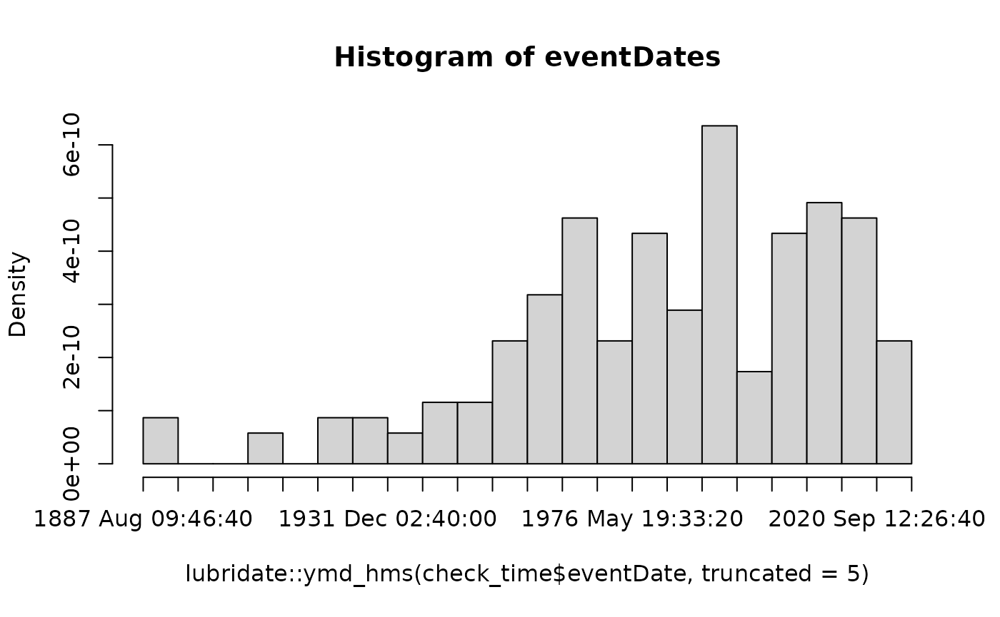

# BeeBDC vignette

## [](https://github.com/jbdorey/BeeBDC)

## 0.0 Script preparation

### 0.1 Working directory

To start off with, have a think about where you want to work from.
**BeeBDC** and **bdc** can create quite a few files and so setting this
up well from the start is a good idea. If you are afraid that you might
run out of storage, this could also be on a hard drive; but you can
always change that later. Defining your RootPath at the top of your
script, only once, shoudl make your life easier.

Choose the path to the root folder in which all other folders can be
found.

``` r
RootPath <- paste0("/your/path/here")
```

``` r
# Create the working directory in the RootPath if it doesn't exist already
if (!dir.exists(paste0(RootPath, "/Data_acquisition_workflow"))) {
    dir.create(paste0(RootPath, "/Data_acquisition_workflow"), recursive = TRUE)
}
# Set the working directory
setwd(paste0(RootPath, "/Data_acquisition_workflow"))
```

### 0.2 Install packages (if needed)

> #### Is this your first time using the *sf* or *terra* packages?
>
> The first time that you use **terra** or **sf** on a new computer you
> may need to install some dependencies. Try to install the **terra**
> and **sf** packages first but then come back here if that doesn’t
> work.
>
> ###### Windows:
>
> On **Windows**, you need to first install
> [Rtools](https://cran.r-project.org/bin/windows/Rtools/) to get a C++
> compiler that **R** can use. You need a recent version of **Rtools42**
> (rtools42-5355-5357).
>
> ###### MacOS:
>
> On **macOS**, you can use [MacPorts](https://www.macports.org/) or
> [Homebrew](https://brew.sh/).
>
> With **MacPorts** you can do
>
> `sudo port install R-terra`
>
> With **Homebrew**, you need to first install GDAL:
>
> `brew install pkg-config`
>
> `brew install gdal`
>
> Followed by (note the additional configuration argument needed for
> Homebrew)
>
> ``` r
> # Install terra
> install.packages("terra", type = "source", configure.args = "--with-proj-lib=$(brew --prefix)/lib/")
> # install sf
> install.packages("sf", type = "source", configure.args = "--with-proj-lib=$(brew --prefix)/lib/")
>
> library(terra)
> library(sf)
> ```

If you have **sf** and **terra** isntalled, you can now install
**BeeBDC**.

``` r
install.packages("BeeBDC")
library(BeeBDC)
```

**BeeBDC** also has a few optional packages that are required for a
subset of the functions. You don’t need to isntall these now, if you
don’t want to, but you can do so later!

You can optionally install **BiocManager**, **devtools**,
**ComplexHeatmap**, **rnaturalearthhires**, and **taxadb** or do it
later as you wish.

``` r
if (!require("BiocManager", quietly = TRUE)) install.packages("BiocManager", repos = "http://cran.us.r-project.org")

BiocManager::install("ComplexHeatmap")
```

``` r
# Install remotes if needed
if (!require("remotes", quietly = TRUE)) install.packages("remotes", repos = "http://cran.us.r-project.org")
# Download and then load rnaturalearthhires
remotes::install_github("ropensci/rnaturalearthhires")
install.packages("rnaturalearthhires", repos = "https://ropensci.r-universe.dev",
    type = "source")
library(rnaturalearthhires)
```

``` r
install.packages("taxadb")
```

Set up the directories used by **BeeBDC**. These directories include
where the data, figures, reports, etc. will be saved. The RDoc needs to
be a path RELATIVE to the RootPath; i.e., the file path from which the
two diverge.

``` r
BeeBDC::dirMaker(RootPath = RootPath, RDoc = "vignettes/BeeBDC_main.Rmd") %>%
    # Add paths created by this function to the environment()
list2env(envir = parent.env(environment()))
```

### 0.3 Load packages

Let’s go ahead and load our packages before we start!

``` r
lapply(c("ComplexHeatmap", "magrittr"), library, character.only = TRUE)
## Loading required package: grid
## 
## Attaching package: 'grid'
## The following object is masked from 'package:terra':
## 
##     depth
## ========================================
## ComplexHeatmap version 2.26.0
## Bioconductor page: http://bioconductor.org/packages/ComplexHeatmap/
## Github page: https://github.com/jokergoo/ComplexHeatmap
## Documentation: http://jokergoo.github.io/ComplexHeatmap-reference
## 
## If you use it in published research, please cite either one:
## - Gu, Z. Complex Heatmap Visualization. iMeta 2022.
## - Gu, Z. Complex heatmaps reveal patterns and correlations in multidimensional 
##     genomic data. Bioinformatics 2016.
## 
## 
## The new InteractiveComplexHeatmap package can directly export static 
## complex heatmaps into an interactive Shiny app with zero effort. Have a try!
## 
## This message can be suppressed by:
##   suppressPackageStartupMessages(library(ComplexHeatmap))
## ========================================
## 
## Attaching package: 'ComplexHeatmap'
## The following object is masked from 'package:terra':
## 
##     draw
## The following object is masked from 'package:R.utils':
## 
##     draw
```

------------------------------------------------------------------------

## 1.0 Data merge

There are many ways to get a good starting dataset. For **bees**, we
have compiled a bunch of large datasets that we will periodically update
and make available. However, we have also made available the code to
update many of these public datasets yourself in the [**bee data prep
vignette**](https://jbdorey.github.io/BeeBDC/articles/articles/dataPrep.md).

If you are looking to just make your own dataset to feed in, for
example, from another taxon. Great! We have some usefull tools below and
so does the **bdc** package! Feel free to take you pick at how you
compile your starting data but just note that **BeeBDC**, **bdc**, and
**coordinateCleaner** like (and often assume) that your data are in a
[Darwin Core](https://dwc.tdwg.org) format.

**Attention:**  
Although each line of code has been validated, in order to save time
knitting the R **markdown** document the next section is display only.
If you are not data merging (section 1.0) or preparing the data (section
2.0), feel free to skip to Section 3.0 Initial flags.

### 1.1 Download ALA data

If you’re interested in using data from the *Atlas of Living Australia
(ALA)* or one of the other Atlas repositories, you can use
[`BeeBDC::atlasDownloader()`](https://jbdorey.github.io/BeeBDC/reference/atlasDownloader.md)
below to access and download those files and their metadata easily
enough. You may, however, need to ensure that you have an account that
you can link to the download. Especially fo the sake of a doi.

To make an account with ALA in order to download your data visit this
link — <https://auth.ala.org.au/userdetails/registration/createAccount>

      BeeBDC::atlasDownloader(path = DataPath,
               userEmail = "your@email.edu.au",
               atlas = "ALA",
               ALA_taxon = "Apiformes")

### 1.2 Import and merge ALA, SCAN, iDigBio, and GBIF data

If you are planning on combining data from ALA, SCAN, iDigBio, and/or
GBIF,
[`BeeBDC::repoMerge()`](https://jbdorey.github.io/BeeBDC/reference/repoMerge.md)
is a handy function that should help you with this and help you to
extract all of the metadata and citations that you need. Remember, that
the main workflow only needs a nice Darwin Core-formatted dataset with
which to work!

Supply the path to where the data are, the save_type is either
“csv_files” or “R_file”.

      DataImp <- BeeBDC::repoMerge(path = DataPath, 
                      occ_paths = BeeBDC::repoFinder(path = DataPath),
                      save_type = "R_file")

If there is an error in finding a file, run
[`repoFinder()`](https://jbdorey.github.io/BeeBDC/reference/repoFinder.md)
by itself to troubleshoot. For example:

                #BeeBDC::repoFinder(path = DataPath)
                #OUTPUT:
                #$ALA_data
                #[1] "F:/BeeDataCleaning2022/BeeDataCleaning/BeeDataCleaning/BeeData/ALA_galah_path/galah_download_2022-09-15/data.csv"
      
                #$GBIF_data
                #[1] "F:/BeeDataCleaning2022/BeeDataCleaning/BeeDataCleaning/BeeData/GBIF_webDL_30Aug2022/0000165-220831081235567/occurrence.txt"
                #[2] "F:/BeeDataCleaning2022/BeeDataCleaning/BeeDataCleaning/BeeData/GBIF_webDL_30Aug2022/0436695-210914110416597/occurrence.txt"
                #[3] "F:/BeeDataCleaning2022/BeeDataCleaning/BeeDataCleaning/BeeData/GBIF_webDL_30Aug2022/0436697-210914110416597/occurrence.txt"
                #[4] "F:/BeeDataCleaning2022/BeeDataCleaning/BeeDataCleaning/BeeData/GBIF_webDL_30Aug2022/0436704-210914110416597/occurrence.txt"
                #[5] "F:/BeeDataCleaning2022/BeeDataCleaning/BeeDataCleaning/BeeData/GBIF_webDL_30Aug2022/0436732-210914110416597/occurrence.txt"
                #[6] "F:/BeeDataCleaning2022/BeeDataCleaning/BeeDataCleaning/BeeData/GBIF_webDL_30Aug2022/0436733-210914110416597/occurrence.txt"
                #[7] "F:/BeeDataCleaning2022/BeeDataCleaning/BeeDataCleaning/BeeData/GBIF_webDL_30Aug2022/0436734-210914110416597/occurrence.txt"
                        
                #$iDigBio_data
                #[1] "F:/BeeDataCleaning2022/BeeDataCleaning/BeeDataCleaning/BeeData/iDigBio_webDL_30Aug2022/5aa5abe1-62e0-4d8c-bebf-4ac13bd9e56f/occurrence_raw.csv"
      
                #$SCAN_data
                #character(0)
                #Failing because SCAN_data seems to be missing. Downloaded separatly from the one drive

Load in the most-recent version of these data if needed. This will
return a list with:

1.  The occurrence dataset with attributes (.\$Data_WebDL)

2.  The appended eml file (.\$eml_files)

        DataImp <- BeeBDC::importOccurrences(path = DataPath,
                               fileName = "BeeData_")

### 1.5 Save data

Choose the type of data format you want to use in saving your work in
1.x.

      BeeBDC::dataSaver(path = DataPath,# The main path to look for data in
           save_type = "CSV_file", # "R_file" OR "CSV_file"
           occurrences = Complete_data$Data_WebDL, # The existing datasheet
           eml_files = Complete_data$eml_files, # The existing EML files
           file_prefix = "Fin_") # The prefix for the fileNames
    rm(Complete_data, DataImp)

## 2.0 Data preparation

The data preparation section of the script relates mostly to integrating
**bee** occurrence datasets and corrections and so may be skipped by
many general taxon users.

### 2.1 Standardise datasets

You may either use:

- 1.  the bdc import method (works well with general datasets) ***or***
- 2.  the jbd import method (works well with above data merge)

#### a. bdc import

The bdc import is **NOT** truly supported here, but provided as an
example. Please go to section 2.1b below. Read in the **bdc** metadata
and standardise the dataset to bdc.

            bdc_metadata <- readr::read_csv(paste(DataPath, "out_file", "bdc_integration.csv", sep = "/"))
            # ?issue — datasetName is a darwinCore field already!
            # Standardise the dataset to bdc
            db_standardized <- bdc::bdc_standardize_datasets(
              metadata = bdc_metadata,
              format = "csv",
              overwrite = TRUE,
              save_database = TRUE)
            # read in configuration description file of the column header info
            config_description <- readr::read_csv(paste(DataPath, "Output", "bdc_configDesc.csv",
                                                        sep = "/"), 
                                                  show_col_types = FALSE, trim_ws = TRUE)
      

#### b. jbd import

Find the path, read in the file, and add the *database_id* column.

      occPath <- BeeBDC::fileFinder(path = DataPath, fileName = "Fin_BeeData_combined_")


      db_standardized <- readr::read_csv(occPath, 
                                           # Use the basic ColTypeR function to determine types
                                         col_types = BeeBDC::ColTypeR(), trim_ws = TRUE) %>%
                                         dplyr::mutate(database_id = paste("Dorey_data_", 
                                         1:nrow(.), sep = ""),
                                         .before = family)

#### 2.2 Match database_id

If you have prior runs from which you’d like to match *database_id*s
with from the current run, you may use the below script to try to match
*database_id*s with prior runs.

Read in a prior run of choice.

      priorRun <- BeeBDC::fileFinder(path = DataPath,
                              file = "01_prefilter_database_9Aug22.csv") %>%
        readr::read_csv(file = ., col_types = BeeBDC::ColTypeR())

This function will attempt to find the *database_id*s from prior runs.

      db_standardized <- BeeBDC::idMatchR(
      currentData = db_standardized,
      priorData = priorRun,
        # First matches will be given preference over later ones
      matchBy = tibble::lst(c("gbifID", "dataSource"),
                            c("catalogNumber", "institutionCode", "dataSource", "decimalLatitude",
                              "decimalLongitude"),
                            c("occurrenceID", "dataSource","decimalLatitude","decimalLongitude"),
                            c("recordId", "dataSource","decimalLatitude","decimalLongitude"),
                            c("id", "dataSource","decimalLatitude","decimalLongitude"),
                            # Because INHS was entered as it's own dataset but is now included in the GBIF    download...
                            c("catalogNumber", "institutionCode", "dataSource",
                              "decimalLatitude","decimalLongitude")),
        # You can exclude datasets from prior by matching their prefixs — before first underscore:
      excludeDataset = c("ASP", "BMin", "BMont", "CAES", "EaCO", "Ecd", "EcoS",
                         "Gai", "KP", "EPEL", "CAES", "EaCO", "FSCA", "SMC", "Lic", "Arm",
                         "VicWam"))

     # Remove redundant files
    rm(priorRun)

Save the dataset.

      db_standardized %>%
        readr::write_excel_csv(.,
                         paste(OutPath_Intermediate, "00_prefilter_database.csv",
                               sep = "/"))

## 3.0 Initial flags

Now that we have some kind of dataset put together in Darwin Core
format, we can start to think about actually doing some filtering! Keep
in mind, as you progress through this vignette, that not all filters
might be relevant for your hypothesis! So, thinking about then ones that
you apply at the end throughout is probably a useful endeavor. However,
do keep in mind that the only thing that it costs you to run every
filter is time.

Read data back in if needed. OutPath_Intermediate (and a few other
directories) should be have been created and saved to the global
environment by
[`dirMaker()`](https://jbdorey.github.io/BeeBDC/reference/dirMaker.md).

    if(!exists("db_standardized")){
      db_standardized <- readr::read_csv(paste(OutPath_Intermediate, "00_prefilter_database.csv",
                                        sep = "/"), col_types = BeeBDC::ColTypeR())}

Normally, you would use the full dataset, as read in above. But, for the
sake of this vignette, we will use a combination of two example
datasets. These example datasets can further be very useful for testing
functions if you’re ever feeling a bit confused and overwhelmed!

``` r
data("bees3sp", package = "BeeBDC")
data("beesRaw", package = "BeeBDC")
db_standardized <- dplyr::bind_rows(beesRaw, 
                                      # Only keep a subset of columns from bees3sp
                             bees3sp %>% dplyr::select(tidyselect::all_of(colnames(beesRaw)), countryCode))
```

*For more details about the **bdc** package, please see their
[tutorial.](https://brunobrr.github.io/bdc/articles/prefilter.html)*

### 3.1 SciName

Flag occurrences with NO *scientificName* provided.

``` r
check_pf <- bdc::bdc_scientificName_empty(data = db_standardized, sci_name = "scientificName")
## 
## bdc_scientificName_empty:
## Flagged 0 records.
## One column was added to the database.
# now that this is saved, remove it to save space in memory
rm(db_standardized)
```

### 3.2 MissCoords

Flag occurrences with missing *decimalLatitude* and *decimalLongitude*.

``` r
check_pf <- bdc::bdc_coordinates_empty(data = check_pf, lat = "decimalLatitude",
    lon = "decimalLongitude")
## 
## bdc_coordinates_empty:
## Flagged 42 records.
## One column was added to the database.
```

### 3.3 OutOfRange

Flag occurrences that are not on Earth (outside of -180 to 180 or -90 to
90 degrees).

``` r
check_pf <- bdc::bdc_coordinates_outOfRange(data = check_pf, lat = "decimalLatitude",
    lon = "decimalLongitude")
## 
## bdc_coordinates_outOfRange:
## Flagged 0 records.
## One column was added to the database.
```

### 3.4 Source

Flag occurrences that don’t match the *basisOfRecord* types below.

``` r
check_pf <- bdc::bdc_basisOfRecords_notStandard(
  data = check_pf,
  basisOfRecord = "basisOfRecord",
  names_to_keep = c(
    # Keep all plus some at the bottom.
    "Event",
    "HUMAN_OBSERVATION",
    "HumanObservation",
    "LIVING_SPECIMEN",
    "LivingSpecimen",
    "MACHINE_OBSERVATION",
    "MachineObservation",
    "MATERIAL_SAMPLE",
    "O",
    "Occurrence",
    "MaterialSample",
    "OBSERVATION",
    "Preserved Specimen",
    "PRESERVED_SPECIMEN",
    "preservedspecimen Specimen",
    "Preservedspecimen",
    "PreservedSpecimen",
    "preservedspecimen",
    "S",
    "Specimen",
    "Taxon",
    "UNKNOWN",
    "",
    NA,
    "NA",
    "LITERATURE", 
    "None", "Pinned Specimen", "Voucher reared", "Emerged specimen"
  ))
## 
## bdc_basisOfRecords_notStandard:
## Flagged 1 of the following specific nature:
##  MATERIAL_CITATION 
## One column was added to the database.
```

### 3.5 CountryName

Try to harmonise country names.

#### a. prepare dataset

Fix up country names based on common problems above and extract ISO2
codes for occurrences. The below are problems in the global bee dataset,
but you may find others in your own dataset. No harm in running the
below code and maybe altering it for your own use. Otherwise, don’t get
too caught up in it :)

``` r
check_pf_noNa <- BeeBDC::countryNameCleanR(
  data = check_pf,
    # Create a Tibble of common issues in country names and their replacements
  commonProblems = dplyr::tibble(problem = c('U.S.A.', 'US','USA','usa','UNITED STATES',
                                              'United States','U.S.A','MX','CA','Bras.','Braz.',
                                              'Brasil','CNMI','USA TERRITORY: PUERTO RICO'),
                                  fix = c('United States of America','United States of America',
                                          'United States of America','United States of America',
                                          'United States of America','United States of America',
                                          'United States of America','Mexico','Canada','Brazil',
                                          'Brazil','Brazil','Northern Mariana Islands','PUERTO.RICO'))
  )
##  - Using default country names and codes from https:en.wikipedia.org/wiki/ISO_3166-1_alpha-2 - static version from July 2022.
```

#### b. run function

Get country name from coordinates using a wrapper around the
`BeeBDC::jbd_country_from_coordinates()` function. Because our dataset
is much larger than those used to design **bdc**, we have made it so
that you can analyse data in smaller pieces. Additionally, like some
other functions in **BeeBDC**, we have implemented parallel operations
(using mc.cores = \#cores in stepSize = \#rowsPerOperation); see
‘?[`BeeBDC::jbd_CfC_chunker()`](https://jbdorey.github.io/BeeBDC/reference/jbd_CfC_chunker.md)’
for details. NOTE: In an actual run you should use scale = “large”

``` r
suppressWarnings(
  countryOutput <- BeeBDC::jbd_CfC_chunker(data = check_pf_noNa,
                                   lat = "decimalLatitude",
                                   lon = "decimalLongitude",
                                   country = "country",
                                    # How many rows to process at a time
                                   stepSize = 1000000,
                                    # Start row
                                   chunkStart = 1,
                                   path = OutPath_Intermediate,
                                    # Normally, please use scale = "large"
                                   scale = "medium",
                                   mc.cores = 1),
  classes = "warning")
##  - Starting parallel operation. Unlike the serial operation (mc.cores = 1) , a parallel operation will not provide running feedback. Please be patient  as this function may take some time to complete. Each chunk will be run on  a seperate thread so also be aware of RAM usage.
##  - We have updated the country names of 39 occurrences that previously had no country name assigned.
```

#### c. re-merge

Join these datasets.

``` r
check_pf <- dplyr::left_join(check_pf, countryOutput, by = "database_id", suffix = c("",
    "CO")) %>%
    # Take the new country name if the original is NA
dplyr::mutate(country = dplyr::if_else(is.na(country), countryCO, country)) %>%
    # Remove duplicates if they arose from left_join!
dplyr::distinct()
```

Save the dataset.

``` r
check_pf %>%
    readr::write_excel_csv(., paste(OutPath_Intermediate, "01_prefilter_database.csv",
        sep = "/"))
```

Re-load in if needed.

``` r
if (!exists("check_pf")) {
    check_pf <- readr::read_csv(paste(DataPath, "Output", "Intermediate", "01_prefilter_database.csv",
        sep = "/"), col_types = BeeBDC::ColTypeR())
}
```

Remove these interim datasets.

``` r
rm(check_pf_noNa, countryOutput)
```

### 3.6 StandardCoNames

Run the function, which standardises country names and adds ISO2 codes,
if needed.

``` r
  # Standardise country names and add ISO2 codes if needed
check_pf <- bdc::bdc_country_standardized(
  # Remove the countryCode and country_suggested columns to avoid an error with 
    # where two "countryCode" and "country_suggested" columns exist (i.e. if the dataset has been  
    # run before)
  data = check_pf %>% dplyr::select(!tidyselect::any_of(c("countryCode", "country_suggested"))),
  country = "country"
) 
## Loading auxiliary data: country names
## Standardizing country names
## country found: Argentina
## country found: Australia
## country found: Belgium
## country found: Brazil
## country found: Canada
## country found: Colombia
## country found: Costa Rica
## country found: Ecuador
## country found: Estonia
## country found: Finland
## country found: France
## country found: Germany
## country found: Ireland
## country found: Mexico
## country found: Norway
## country found: South Africa
## country found: Sweden
## country found: Switzerland
## country found: United Kingdom
## country found: United States of America
## 
## bdc_country_standardized:
## The country names of 141 records were standardized.
## Two columns ('country_suggested' and 'countryCode') were added to the database.
```

### 3.7 TranspCoords

Flag and correct records when *decimalLatitude* and *decimalLongitude*
appear to be transposed. We created this chunked version of
[`bdc::bdc_coordinates_transposed()`](https://brunobrr.github.io/bdc/reference/bdc_coordinates_transposed.html)
because it is very RAM-heavy using our large bee dataset. Like many of
our other ‘jbd\_…’ functions there are other improvements - e.g.,
parallel running.

NOTE: Usually you would use scale = “large”, which requires
rnaturalearthhires

``` r
check_pf <- BeeBDC::jbd_Ctrans_chunker(
  # bdc_coordinates_transposed inputs
  data = check_pf,
  id = "database_id",
  lat = "decimalLatitude",
  lon = "decimalLongitude",
  country = "country",
  countryCode = "countryCode",
  border_buffer = 0.2, # in decimal degrees (~22 km at the equator)
  save_outputs = TRUE,
  sci_names = "scientificName",
  # chunker inputs
  stepSize = 1000000,  # How many rows to process at a time
  chunkStart = 1,  # Start row
  append = FALSE,  # If FALSE it may overwrite existing dataset
  progressiveSave = FALSE,
    # In a normal run, please use scale = "large"
  scale = "medium",
  path = OutPath_Check,
  mc.cores = 1
) 
##  - Running chunker with:
## stepSize = 1,000,000
## chunkStart = 1
## chunkEnd = 1,000,000
## append = FALSE
##  - Starting chunk 1...
## From 1 to 1,000,000
##  - Finished chunk 1 of 1. Total records examined: 205
```

Get a quick summary of the number of transposed records.

``` r
table(check_pf$coordinates_transposed, useNA = "always")
```

Save the dataset.

``` r
check_pf %>%
    readr::write_excel_csv(., paste(OutPath_Intermediate, "01_prefilter_database.csv",
        sep = "/"))
```

Read the data in again if needed.

``` r
if (!exists("check_pf")) {
    check_pf <- readr::read_csv(paste(OutPath_Intermediate, "01_prefilter_database.csv",
        sep = "/"), col_types = BeeBDC::ColTypeR())
}
```

### 3.8 Coord-country

Collect all country names in the *country_suggested* column. We rebuilt
a **bdc** function to flag occurrences where the coordinates are
inconsistent with the provided country name.

``` r
check_pf <- BeeBDC::jbd_coordCountryInconsistent(data = check_pf, lon = "decimalLongitude",
    lat = "decimalLatitude", scale = 50, pointBuffer = 0.01)
##  - Downloading naturalearth map...
## Spherical geometry (s2) switched off
##  - Extracting initial country names without buffer...
##  - Buffering naturalearth map by pointBuffer...
## dist is assumed to be in decimal degrees (arc_degrees).
##  - Extracting FAILED country names WITH buffer...
## 
## jbd_coordinates_country_inconsistent:
## Flagged 2 records.
## The column, '.coordinates_country_inconsistent', was added to the database.
##  - Completed in 0.78 secs
```

Save the dataset.

``` r
check_pf %>%
    readr::write_excel_csv(., paste(OutPath_Intermediate, "01_prefilter_database.csv",
        sep = "/"))
```

### 3.9 GeoRefIssue

This function identifies records whose coordinates can potentially be
extracted from locality information, which must be manually checked
later.

``` r
xyFromLocality <- bdc::bdc_coordinates_from_locality(data = check_pf, locality = "locality",
    lon = "decimalLongitude", lat = "decimalLatitude", save_outputs = FALSE)
## 
## bdc_coordinates_from_locality 
## Found 38 records missing or with invalid coordinates but with potentially useful information on locality.
```

``` r
# Save the resultant data
xyFromLocality %>%
    readr::write_excel_csv(paste(OutPath_Check, "01_coordinates_from_locality.csv",
        sep = "/"))
```

Remove the spent data.

``` r
rm(xyFromLocality)
```

### 3.10 Flag Absent

Many of the large data repositories are happy to store presence and
absence records. This is very important to know, because if you leave
absence records in your dataset and analyse them as an occurrence
record… well, you’ll be doing a no-no to say the very least!

Flag the records marked as “absent”.

``` r
check_pf <- BeeBDC::flagAbsent(data = check_pf, PresAbs = "occurrenceStatus")
## \.occurrenceAbsent:
##  Flagged 8 absent records:
##  One column was added to the database.
```

### 3.11 flag License

Flag the records that may not be used according to their license
information.

``` r
check_pf <- BeeBDC::flagLicense(data = check_pf,
                    strings_to_restrict = "all",
                    # DON'T flag if in the following dataSource(s)
                    excludeDataSource = NULL)
## \.unLicensed:
##  Flagged 0 records that may NOT be used.
##  One column was added to the database.
```

### 3.12 GBIF issue

Flag select issues that are flagged by GBIF.

``` r
check_pf <- BeeBDC::GBIFissues(data = check_pf, issueColumn = "issue", GBIFflags = c("COORDINATE_INVALID",
    "ZERO_COORDINATE"))
##  - jbd_GBIFissues:
## Flagged 0 
##   The .GBIFflags column was added to the database.
```

### 3.13 Flag Reports

#### a. Save flags

Save the flags so far. This function will make sure that you keep a copy
of everything that has been flagged up until now. This will be updated
throughout the script and can accessed at the end, so be wary of moving
files around manually. However, these data will also still be maintained
in the main running file, so this is an optional fail-safe.

``` r
flagFile <- BeeBDC::flagRecorder(
  data = check_pf,
  outPath = paste(OutPath_Report, sep =""),
  fileName = paste0("flagsRecorded_", Sys.Date(),  ".csv"),
    # These are the columns that will be kept along with the flags
  idColumns = c("database_id", "id", "catalogNumber", "occurrenceID", "dataSource"),
    # TRUE if you want to find a file from a previous part of the script to append to
  append = FALSE)
```

Update the *.summary* column

``` r
check_pf <- BeeBDC::summaryFun(
  data = check_pf,
    # Don't filter these columns (or NULL)
  dontFilterThese = NULL,
    # Remove the filtering columns?
  removeFilterColumns = FALSE,
    # Filter to ONLY cleaned data?
  filterClean = FALSE)
##  - We will flag all columns starting with '.'
##  - summaryFun:
## Flagged 52 
##   The .summary column was added to the database.
```

#### c. Reporting

Use **bdc** to generate reports.

``` r
(report <- bdc::bdc_create_report(data = check_pf, database_id = "database_id", workflow_step = "prefilter",
    save_report = TRUE))
```

### 3.14 Save

Save the intermediate dataset.

``` r
check_pf %>%
    readr::write_excel_csv(., paste(OutPath_Intermediate, "01_prefilter_output.csv",
        sep = "/"))
```

## 4.0 Taxonomy

*For more information about the corresponding bdc functions used in this
section, see their
[tutorial](https://brunobrr.github.io/bdc/articles/taxonomy.html).*

Read in the filtered dataset or rename the 3.x dataset for 4.0.

``` r
if (!exists("check_pf")) {
    database <- readr::read_csv(paste(OutPath_Intermediate, "01_prefilter_output.csv",
        sep = "/"), col_types = BeeBDC::ColTypeR())
} else {
    # OR rename and remove
    database <- check_pf
    # Remove spent dataset
    rm(check_pf)
}
```

Remove *names_clean* if it already exists (i.e. you have run the
following functions before on this dataset before).

``` r
database <- database %>%
    dplyr::select(!tidyselect::any_of("names_clean"))
```

### 4.1 Prep data names

This step cleans the database’s *scientificName* column.

**! MAC**: You might need to install **gnparser** through terminal using
[homebrew](https://brew.sh) — brew brew tap gnames/gn brew install
gnparser

**Attention:**  
This can be difficult for a Windows install. Ensure you have the most
recent version of R, R Studio, and R packages. Also, check package
‘**rgnparser**’ is installed correctly. If you still can not get the
below code to work, you may have to download the latest version of
‘gnparser’ from
[here](https://github.com/gnames/gnparser/releases/tag/v1.6.9). You may
then need to manually install it and edit your systems environmental
variable PATH to locate ‘gnparser.exe’. See
[here](https://github.com/gnames/gnparser#installation).

``` r
parse_names <- bdc::bdc_clean_names(sci_names = database$scientificName, save_outputs = FALSE)
```

    ## The latest gnparser version is v1.7.4
    ## gnparser has been installed to /home/runner/bin
    ## 
    ## >> Family names prepended to scientific names were flagged and removed from 0 records.
    ## >> Terms denoting taxonomic uncertainty were flagged and removed from 0 records.
    ## >> Other issues, capitalizing the first letter of the generic name, replacing empty names by NA, and     removing extra spaces, were flagged and corrected or removed from 1 records.
    ## >> Infraspecific terms were flagged and removed from 0 records.

Keep only the *.uncer_terms* and *names_clean* columns.

``` r
parse_names <- parse_names %>%
    dplyr::select(.uncer_terms, names_clean)
```

Merge names with the complete dataset.

``` r
database <- dplyr::bind_cols(database)
rm(parse_names)
```

### 4.2 Harmonise taxonomy

Download the custom taxonomy file from the **BeeBDC** package and
[Discover Life](https://www.discoverlife.org) website.

``` r
taxonomyFile <- BeeBDC::beesTaxonomy()
```

``` r
# load in the small test dataset i nthe background
system.file("extdata", "testTaxonomy.rda", package = "BeeBDC") |>
    load()
# Rename the file
taxonomyFile <- testTaxonomy
rm(testTaxonomy)
```

**Attention:**  
As of version 1.1.0, **BeeBDC** now has a new function that can download
taxonomies using the **taxadb** package and transform them into the
**BeeBDC** format. The function,
[`BeeBDC::taxadbToBeeBDC()`](https://jbdorey.github.io/BeeBDC/reference/taxadbToBeeBDC.md),
allows the user to choose their desired provider (e.g., “gbif”,
“itis”…), version, taxon name and rank, and to save the taxonomy as a
readable csv or not. For example for the bee genus *Apis*:

    ApisTaxonomy <- BeeBDC::taxadbToBeeBDC(
      name = "Apis",
      rank = "Genus",
      provider = "gbif",
      version = "22.12",
      outPath = getwd(),
      fileName = "ApisTaxonomy.csv"
      )

Harmonise the names in the occurrence tibble. This flags the occurrences
without a matched name and matches names to their correct name according
to [Discover Life](https://www.discoverlife.org). You can also use
multiple cores to achieve this. See
‘?[`harmoniseR()`](https://jbdorey.github.io/BeeBDC/reference/HarmoniseR.md)’
for details.

``` r
database <- BeeBDC::harmoniseR(path = DataPath, #The path to a folder that the output can be saved
                       taxonomy = taxonomyFile, # The formatted taxonomy file
                       data = database,
                       mc.cores = 1)
##  - Formatting taxonomy for matching...
## The names_clean column was not found and will be temporarily copied from scientificName
## 
##  - Harmonise the occurrence data with unambiguous names...
## 
##  - Attempting to harmonise the occurrence data with ambiguous names...
##  - Formatting merged datasets...
## Removing the names_clean column...
##  - We matched valid names to 201 of 205 occurrence records. This leaves a total of 4 unmatched occurrence records.
## 
## harmoniseR:
## 4
## records were flagged.
## The column, '.invalidName' was added to the database.
##  - We updated the following columns: scientificName, species, family, subfamily, genus, subgenus, specificEpithet, infraspecificEpithet, and scientificNameAuthorship. The previous scientificName column was converted to verbatimScientificName
##  - Completed in 0.22 secs

rm(taxonomyFile)
```

Save the harmonised file.

``` r
database %>%
    readr::write_excel_csv(., paste(DataPath, "Output", "Intermediate", "02_taxonomy_database.csv",
        sep = "/"))
```

### 4.3 Save flags

Save the flags so far. This will find the most-recent flag file and
append your new data to it. You can double-check the data and number of
columns if you’d like to be thorough and sure that all of data are
intact.

``` r
flagFile <- BeeBDC::flagRecorder(data = database, outPath = paste(OutPath_Report,
    sep = ""), fileName = paste0("flagsRecorded_", Sys.Date(), ".csv"), idColumns = c("database_id",
    "id", "catalogNumber", "occurrenceID", "dataSource"), append = TRUE, printSummary = TRUE)
```

## 5.0 Space

*The final frontier or whatever.*

Read in the latest database.

``` r
if (!exists("database")) {
    database <- readr::read_csv(paste(OutPath_Intermediate, "02_taxonomy_database.csv",
        sep = "/"), col_types = BeeBDC::ColTypeR())
}
```

### 5.1 Coordinate precision

This function identifies records with a coordinate precision below a
specified number of decimal places. For example, the precision of a
coordinate with 1 decimal place is 11.132 km at the equator, i.e., the
scale of a large city. The major difference between the **bdc** and
**BeeBDC** functions is that
[`BeeBDC::jbd_coordinates_precision()`](https://jbdorey.github.io/BeeBDC/reference/jbd_coordinates_precision.md)
will only flag occurrences if BOTH latitude and longitude are rounded
(as opposed to only one of these). This might be important where Excel
has decided to apply some rounding to one of either latitude or
longitude…

Coordinates with one, two, or three decimal places present a precision
of ~11.1 km, ~1.1 km, and ~111 m at the equator, respectively.

``` r
check_space <- BeeBDC::jbd_coordinates_precision(data = database, lon = "decimalLongitude",
    lat = "decimalLatitude", ndec = 2  # number of decimals to be tested
)
## jbd_coordinates_precision:
## Flagged 61 records
## The '.rou' column was added to the database.
```

Remove the spent dataset.

``` r
rm(database)
```

Save the resulting file.

``` r
check_space %>%
    readr::write_excel_csv(., paste(OutPath_Intermediate, "03_space_inter_database.csv",
        sep = "/"))
```

### 5.2 Common spatial issues

Only run for occurrences through `clean_coordinates()` that are
spatially ‘valid’.

``` r
tempSpace <- check_space %>%
    dplyr::filter(!.coordinates_empty == FALSE) %>%
    dplyr::filter(!.coordinates_outOfRange == FALSE)
```

Next, we will flag common spatial issues using functions of the package
**CoordinateCleaner**. It addresses some common issues in biodiversity
datasets.

``` r
tempSpace <-
  CoordinateCleaner::clean_coordinates(
    x =  tempSpace,
    lon = "decimalLongitude",
    lat = "decimalLatitude",
    species = "scientificName",
    countries = NULL, # Tests if coords are from x country. This is not needed.
    tests = c(
      "capitals",     # records within 0.5 km of capitals centroids
      "centroids",    # records within 1 km around country and province centroids
      "equal",      # records with equal coordinates
      "gbif",         # records within 1 km of GBIF headquarters. (says 1 degree in package, but code says 1000 m)
      "institutions", # records within 100m of zoo and herbaria
      "zeros"       # records with coordinates 0,0
      # "seas"        # Not flagged as this should be flagged by coordinate country inconsistent
    ),
    capitals_rad = 1000,
    centroids_rad = 500,
    centroids_detail = "both", # test both country and province centroids
    inst_rad = 100, # remove zoo and herbaria within 100m
    range_rad = 0,
    zeros_rad = 0.5,
    capitals_ref = NULL,
    centroids_ref = NULL,
    country_ref = NULL,
    country_refcol = "countryCode",
    inst_ref = NULL,
    range_ref = NULL,
    # seas_scale = 50,
    value = "spatialvalid" # result of tests are appended in separate columns
  ) %>%
      # Remove duplicate .summary column that can be replaced later and turn into a tibble
  dplyr::select(!tidyselect::starts_with(".summary")) %>%
  dplyr::tibble()
```

Re-merge the datasets.

``` r
check_space <- tempSpace %>%
    # Re-bind with the records that were removed earlier
dplyr::bind_rows(check_space %>%
    dplyr::filter(.coordinates_empty == FALSE | .coordinates_outOfRange == FALSE))


rm(tempSpace)
```

Save the intermediate dataset.

``` r
check_space %>%
    readr::write_excel_csv(paste(OutPath_Intermediate, "03_space_inter_database.csv",
        sep = "/"))
```

### 5.3 Diagonal + grid

Finds sequential numbers that could be fill-down errors in lat and long,
and groups by the ‘groupingColumns’. This is accomplished by using a
sliding window with the length determined by minRepeats. Only
coordinates of precision ‘ndec’ (number of decimals in decimal degree
format) will be examined. Note, that this function is very RAM-intensive
and so the use of multiple threads should be approached with caution
depending on your dataset. However, the option is provided.

``` r
check_space <- BeeBDC::diagonAlley(
  data = check_space,
  # The minimum number of repeats needed to find a sequence in for flagging
  minRepeats = 6,
  ndec = 3,
  groupingColumns = c("eventDate", "recordedBy", "datasetName"),
  mc.cores = 1)
## Removing rounded coordinates with BeeBDC::jbd_coordinates_precision...
## jbd_coordinates_precision:
## Removed 68 records.
##  - Merging results and adding the .sequential column...
## 
## diagonAlley:
## Flagged 0 records
## The .sequential column was added to the database.
##  - Completed in 0.03 secs
```

Spatial gridding from rasterisation: Select only the records with more
than `X` occurrences.

``` r
griddingDF <- check_space %>%
    # Exclude NA lat and lon values
tidyr::drop_na(c("decimalLatitude", "decimalLongitude")) %>%
    # Group by the dataset name
dplyr::group_by(datasetName) %>%
    # Remove rows that aren't unique for lat and long
dplyr::distinct(decimalLongitude, decimalLatitude, .keep_all = TRUE) %>%
    # Find the groups with 4 or more occurrence records
dplyr::filter(dplyr::n() >= 4) %>%
    dplyr::ungroup()
```

Run the gridding analysis to find datasets that might be gridded.

``` r
gridded_datasets <- CoordinateCleaner::cd_round(x = griddingDF, lon = "decimalLongitude",
    lat = "decimalLatitude", ds = "datasetName", T1 = 7, min_unique_ds_size = 4,
    test = "both", value = "dataset", graphs = FALSE, verbose = TRUE, reg_out_thresh = 2,
    reg_dist_min = 0.1, reg_dist_max = 2) %>%
    dplyr::tibble()
# The griddingDF is no longer needed. remove it.
rm(griddingDF)
```

Integrate these results with the main dataset.

``` r
check_space <- check_space %>%
  # Join the datasets
  dplyr::left_join(
    # Select the columns of interest
    dplyr::select(gridded_datasets, dataset, lon.flag, lat.flag, summary),
    by = c("datasetName" = "dataset")) %>%
  # Make new columns with more-consistent naming and change the NA vlaues to = TRUE (not flagged)
  dplyr::mutate(.lonFlag = tidyr::replace_na(lon.flag, TRUE),
                .latFlag = tidyr::replace_na(lat.flag, TRUE),
                .gridSummary = tidyr::replace_na(summary, TRUE)) %>%
  # Remove old columns
  dplyr::select(!c(lon.flag, lat.flag, summary))
```

Save the gridded_datasets file for later examination.

``` r
gridded_datasets %>%
    readr::write_excel_csv(paste(OutPath_Intermediate, "03_space_griddedDatasets.csv",
        sep = "/"))

rm(gridded_datasets)
```

### 5.4 Uncertainty

Flag records that exceed a *coordinateUncertaintyInMeters* threshold in
meters.

``` r
check_space <- BeeBDC::coordUncerFlagR(data = check_space, uncerColumn = "coordinateUncertaintyInMeters",
    threshold = 1000)
## \coordUncerFlagR:
##  Flagged 33 geographically uncertain records:
##  The column '.uncertaintyThreshold' was added to the database.
```

### 5.5 Country checklist

This step identifies mismatches between the [Discover
Life](https://www.discoverlife.org) country checklist — `beesChecklist`
— for bee species and the dataset, identifying potential
misidentifications, outliers, etc.’

I would like to eventually add checklists for other taxa or get help in
this; if anyone is willing!

Download the **bee** country-level checklist.

``` r
checklistFile <- BeeBDC::beesChecklist()
```

``` r
# load in the small test dataset in the background
system.file("extdata", "testChecklist.rda", package = "BeeBDC") |>
    load()
# Rename the file
taxonomyFile <- testChecklist
rm(testChecklist)
```

``` r
check_space <- BeeBDC::countryOutlieRs(checklist = checklistFile,
                        data = check_space,
                        keepAdjacentCountry = TRUE,
                        pointBuffer = 0.05,
                          # Scale of map to return, one of 110, 50, 10 OR 'small', 'medium', 'large'
                          # Smaller numbers will result in much longer calculation times. 
                          # We have not attempted a scale of 10.
                        scale = 50,
                        mc.cores = 1)
## Error:
## ! object 'checklistFile' not found
```

``` r
# A list of failed species-country combinations and their numbers can be output
# here
check_space %>%
    dplyr::filter(.countryOutlier == FALSE) %>%
    dplyr::select(database_id, scientificName, country) %>%
    dplyr::group_by(scientificName) %>%
    dplyr::mutate(count_scientificName = n()) %>%
    dplyr::distinct(scientificName, country, .keep_all = TRUE) %>%
    readr::write_excel_csv(paste(OutPath_Intermediate, "03_space_failedCountryChecklist.csv",
        sep = "/"))
```

### 5.6 Map spatial errors

Assemble maps of potential spatial errors and outliers, either one flag
at a time or using the *.summary* column. First, you need to rebuild the
*.summary* column.

Rebuild the *.summary* column.

``` r
check_space <- BeeBDC::summaryFun(data = check_space, dontFilterThese = NULL, removeFilterColumns = FALSE,
    filterClean = FALSE)
```

Use col_to_map in order to map ONE spatial flag at a time or map the
*.summary* column for all flags.

``` r
check_space %>%
  dplyr::filter(.summary == FALSE) %>% # map only records flagged as FALSE
  bdc::bdc_quickmap(
    data = .,
    lon = "decimalLongitude",
    lat = "decimalLatitude",
    col_to_map = ".summary",
    size = 0.9
  )
```

### 5.7 Space report

Create the space report using **bdc**.

``` r
(report <- bdc::bdc_create_report(data = dplyr::tibble(check_space %>%
    dplyr::select(!.uncer_terms)), database_id = "database_id", workflow_step = "space",
    save_report = TRUE))
```

### 5.8 Space figures

Create figures for the spatial data filtering results.

``` r
(figures <- BeeBDC::jbd_create_figures(data = dplyr::tibble(check_space %>%
    dplyr::select(!.uncer_terms)), path = DataPath, database_id = "database_id",
    workflow_step = "space", save_figures = TRUE))
```

For examining the figures, the options are:

- *.cap* = Records around country capital centroid  

- *.cen* = Records around country or province centroids

- *.dbl* = Duplicated coordinates per species

- *.equ* = Identical coordinates

- *.otl* = Geographical outliers

- *.gbf* = Records around the GBIF headquarters

- *.inst* = Records around biodiversity institutions

- *.rou* = Rounded (probably imprecise) coordinates

- *.urb* = Records within urban areas — (Likely not relevant for bees.)

            You can examine these figures, for example, by running:

            figures$.rou

Save interim dataset.

``` r
check_space %>%
    readr::write_excel_csv(paste(OutPath_Intermediate, "03_space_inter_database.csv",
        sep = "/"))
```

### 5.9 Save flags

Save the flags so far.

``` r
BeeBDC::flagRecorder(data = check_space, outPath = paste(OutPath_Report, sep = ""),
    fileName = paste0("flagsRecorded_", Sys.Date(), ".csv"), idColumns = c("database_id",
        "id", "catalogNumber", "occurrenceID", "dataSource"), append = TRUE, printSummary = TRUE)
```

### 5.10 Save

Save the intermediate dataset.

``` r
check_space %>%
    readr::write_excel_csv(., paste(OutPath_Intermediate, "03_space_database.csv",
        sep = "/"))
```

## 6.0 Time

Read in the last database, if needed.

``` r
if (!exists("check_space")) {
    check_time <- readr::read_csv(paste(OutPath_Intermediate, "03_space_database.csv",
        sep = "/"), col_types = BeeBDC::ColTypeR())
} else {
    check_time <- check_space
    # Remove the spent file
    rm(check_space)
}
```

You can plot a histogram of dates here.

``` r
hist(lubridate::ymd_hms(check_time$eventDate, truncated = 5), breaks = 20, main = "Histogram of eventDates")
```



Filter some silly dates that don’t make sense.

``` r
check_time$year <- ifelse(check_time$year > lubridate::year(Sys.Date()) | check_time$year <
    1600, NA, check_time$year)
check_time$month <- ifelse(check_time$month > 12 | check_time$month < 1, NA, check_time$month)
check_time$day <- ifelse(check_time$day > 31 | check_time$day < 1, NA, check_time$day)
```

### 6.1 Recover dates

The
[`dateFindR()`](https://jbdorey.github.io/BeeBDC/reference/dateFindR.md)
function will search through some other columns in order to find and
rescue dates that may not have made it into the correct columns. It will
further update the *eventDate*, *day*, *month*, and *year* columns where
these data were a) missing and b) located in one of the searched
columns.

``` r
check_time <- BeeBDC::dateFindR(data = check_time,
                        # Years above this are removed (from the recovered dates only)
                        maxYear = lubridate::year(Sys.Date()),
                        # Years below this are removed (from the recovered dates only)
                        minYear = 1700)
##  - Preparing data...
##  - Extracting dates from year, month, day columns...
##  - Extracting dates from fieldNotes, locationRemarks, and verbatimEventDate columns in unambiguous ymd, dmy, mdy, and my formats...
##  - Extracting year from fieldNotes, locationRemarks, and verbatimEventDate columns in ambiguous formats...
##  - Formating and combining the new data..
##  - Merging all data, nearly there...
##  - Finished. 
## We now have 1 more full eventDate cells than in the input data.
## We modified dates in 
## 174 occurrences.
##  - As it stands, there are 174 complete eventDates and 31 missing dates.
##  - There are also 175 complete year occurrences to filter from. This is up from an initial count of 174 At this rate, you will stand to lose 30 occurrences on the basis of missing year - Operation time: 0.58677077293396 secs
```

### 6.2 No eventDate

Flag records that simply lack collection date. :(

``` r
check_time <- bdc::bdc_eventDate_empty(data = check_time, eventDate = "eventDate")
## 
## bdc_eventDate_empty:
## Flagged 31 records.
## One column was added to the database.
```

### 6.3 Old records

This will flag records prior to the date selected. The year 1970 is
frequently chosen for species distribution modelling work. You may not
need to filter old records at all, so think critically about your use.
We have chosen 1950 as a lower extreme.

Many other works probably won’t need to apply a year filter at all; for
example, if you want to make a distribution map for a taxonomic work.

``` r
check_time <- bdc::bdc_year_outOfRange(data = check_time, eventDate = "year", year_threshold = 1950)
## 
## bdc_year_outOfRange:
## Flagged 21 records.
## One column was added to the database.
```

### 6.4 Time report

*Not all of time, just the time pertaining to our precise occurrence
records.* Update the *.summary* column.

``` r
check_time <- BeeBDC::summaryFun(
  data = check_time,
  # Don't filter these columns (or NULL)
  dontFilterThese = c(".gridSummary", ".lonFlag", ".latFlag", ".uncer_terms"),
  # Remove the filtering columns?
  removeFilterColumns = FALSE,
  # Filter to ONLY cleaned data?
  filterClean = FALSE)
##  - We will NOT flag the following columns. However, they will remain in the data file.
## .gridSummary, .lonFlag, .latFlag, .uncer_terms
##  - summaryFun:
## Flagged 115 
##   The .summary column was added to the database.
```

``` r
(report <- bdc::bdc_create_report(data = check_time, database_id = "database_id",
    workflow_step = "time", save_report = FALSE))
```

### 6.5 Time figures

Create time results figures.

``` r
figures <- BeeBDC::jbd_create_figures(data = check_time, path = DataPath, database_id = "database_id",
    workflow_step = "time", save_figures = TRUE)
```

You can check figures by using…

``` r
figures$year
```

Save the time-revised data into the intermediate folder.

``` r
check_time %>%
    readr::write_excel_csv(., paste(OutPath_Intermediate, "04_time_database.csv",
        sep = "/"))
```

### 6.6 Save flags

Save the flags so far.

``` r
BeeBDC::flagRecorder(data = check_time, outPath = paste(OutPath_Report, sep = ""),
    fileName = paste0("flagsRecorded_", Sys.Date(), ".csv"), idColumns = c("database_id",
        "id", "catalogNumber", "occurrenceID", "dataSource"), append = TRUE, printSummary = TRUE)
```

## 7.0 De-duplication

The dataset can be re-read here if it does not already exist.

``` r
if (!exists("check_time")) {
    check_time <- readr::read_csv(paste(OutPath_Intermediate, "04_time_database.csv",
        sep = "/"), col_types = BeeBDC::ColTypeR())
}
```

### 7.1 deDuplicate

We will FLAG duplicates here. These input columns can be hacked to
de-duplicate as you wish. This function uses user-specified inputs and
columns to identify duplicate occurrence records. Duplicates are
identified iteratively and will be tallied up, duplicate pairs
clustered, and sorted at the end of the function. The function is
designed to work with Darwin Core data with a *database_id* column, but
it is also modifiable to work with other columns. I would encourage you
to see
‘?[`BeeBDC::dupeSummary()`](https://jbdorey.github.io/BeeBDC/reference/dupeSummary.md)’
for more details as this function is quite modifiable to user needs.

``` r
check_time <- BeeBDC::dupeSummary(
  data = check_time,
  path = OutPath_Report,
   # options are "ID","collectionInfo", or "both"
  duplicatedBy = "collectionInfo", 
    # The columns to generate completeness info from (and to sort by completness)
  completeness_cols = c("decimalLatitude",  "decimalLongitude",
                        "scientificName", "eventDate"),
   # The columns to ADDITIONALLY consider when finding duplicates in collectionInfo
  collectionCols = c("decimalLatitude", "decimalLongitude", "scientificName", "eventDate", 
                     "recordedBy"),
    # The columns to combine, one-by-one with the collectionCols
  collectInfoColumns = c("catalogNumber", "otherCatalogNumbers"),
    # Custom comparisons — as a list of columns to compare
     # RAW custom comparisons do not use the character and number thresholds
  CustomComparisonsRAW = dplyr::lst(c("catalogNumber", "institutionCode", "scientificName")),
     # Other custom comparisons use the character and number thresholds
  CustomComparisons = dplyr::lst(c("gbifID", "scientificName"),
                                  c("occurrenceID", "scientificName"),
                                  c("recordId", "scientificName"),
                                  c("id", "scientificName")),
   # The order in which you want to KEEP duplicated based on data source
   # try unique(check_time$dataSource)
  sourceOrder = c("GBIF","SCAN","iDigBio"),
    # Set the complexity threshold for id letter and number length
     # minimum number of characters when WITH the numberThreshold
  characterThreshold = 2,
     # minimum number of numbers when WITH the characterThreshold
  numberThreshold = 3,
     # Minimum number of numbers WITHOUT any characters
  numberOnlyThreshold = 5
) %>% # END dupeSummary
  dplyr::as_tibble(col_types = BeeBDC::ColTypeR())
##  - Generating a basic completeness summary from the decimalLatitude, decimalLongitude, scientificName, eventDate columns.
## This summary is simply the sum of complete.cases in each column. It ranges from zero to the N of columns. This will be used to sort duplicate rows and select the most-complete rows.
##  - Updating the .summary column to sort by...
##  - We will NOT flag the following columns. However, they will remain in the data file.
## .gridSummary, .lonFlag, .latFlag, .uncer_terms, .uncertaintyThreshold, .unLicensed
##  - summaryFun:
## Flagged 91 
##   The .summary column was added to the database.
##  - Working on CustomComparisonsRAW duplicates...
## 
## Completed iteration 1 of 1:
##  - Identified 0 duplicate records and kept 0 unique records using the column(s): 
## catalogNumber, institutionCode, scientificName
##  - Working on CustomComparisons duplicates...
## 
## Completed iteration 1 of 4:
##  - Identified 0 duplicate records and kept 0 unique records using the column(s): 
## gbifID, scientificName
## 
## Completed iteration 2 of 4:
##  - Identified 0 duplicate records and kept 0 unique records using the column(s): 
## occurrenceID, scientificName
## 
## Completed iteration 3 of 4:
##  - Identified 0 duplicate records and kept 0 unique records using the column(s): 
## recordId, scientificName
## 
## Completed iteration 4 of 4:
##  - Identified 0 duplicate records and kept 0 unique records using the column(s): 
## id, scientificName
##  - Working on collectionInfo duplicates...
## 
## Completed iteration 1 of 2:
##  - Identified 0 duplicate records and kept 0 unique records using the columns: 
## decimalLatitude, decimalLongitude, scientificName, eventDate, recordedBy, and catalogNumber
## 
## Completed iteration 2 of 2:
##  - Identified 0 duplicate records and kept 0 unique records using the columns: 
## decimalLatitude, decimalLongitude, scientificName, eventDate, recordedBy, and otherCatalogNumbers
##  - Clustering duplicate pairs...
## Duplicate pairs clustered. There are 0 duplicates across 0 kept duplicates.
##  - Ordering data by 1. dataSource, 2. completeness and 3. .summary column...
##  - Find and FIRST duplicate to keep and assign other associated duplicates to that one (i.e., across multiple tests a 'kept duplicate', could otherwise be removed)...
##  - Duplicates have been saved in the file and location: /tmp/RtmpD5BOGK/Data_acquisition_workflow/Output/ReportduplicateRun_collectionInfo_2026-01-12.csv
##  - Across the entire dataset, there are now 0 duplicates from a total of 205 occurrences.
##  - Completed in 0.28 secs
```

Save the dataset into the intermediate folder.

``` r
check_time %>%
    readr::write_excel_csv(., paste(OutPath_Intermediate, "04_2_dup_database.csv",
        sep = "/"))
```

### 7.2 Save flags

Save the flags so far.

``` r
BeeBDC::flagRecorder(data = check_time, outPath = paste(OutPath_Report, sep = ""),
    fileName = paste0("flagsRecorded_", Sys.Date(), ".csv"), idColumns = c("database_id",
        "id", "catalogNumber", "occurrenceID", "dataSource"), append = TRUE, printSummary = TRUE)
```

## 8.0 Data filtering

The dataset can be re-read here if it does not already exist.

``` r
if (!exists("check_time")) {
    check_time <- readr::read_csv(paste(OutPath_Intermediate, "04_2_dup_database.csv",
        sep = "/"), col_types = ColTypeR())
}
```

### 8.1 rm Outliers

Read in the most-recent duplicates file (generated by
[`BeeBDC::dupeSummary()`](https://jbdorey.github.io/BeeBDC/reference/dupeSummary.md))
in order to identify the duplicates of the expert outliers.

``` r
if (!exists("duplicates")) {
    duplicates <- BeeBDC::fileFinder(path = DataPath, fileName = "duplicateRun_") %>%
        readr::read_csv()
}
##  - Dates found in file name(s). Finding most-recent file from file name...
##  - Found the following file(s): 
##  /tmp/RtmpD5BOGK/Data_acquisition_workflow/Output/Report/duplicateRun_collectionInfo_2026-01-12.csv
## Rows: 0 Columns: 19
## ── Column specification ────────────────────────────────────────────────────────
## Delimiter: ","
## chr (19): group, database_id, database_id_keep, dupColumn_s, decimalLatitude...
## 
## ℹ Use `spec()` to retrieve the full column specification for this data.
## ℹ Specify the column types or set `show_col_types = FALSE` to quiet this message.
```

Identify the outliers and get a list of their database_ids. This would
require the source outlier files provided with the
[BeeBDC](https://doi.org/10.1101/2023.06.30.547152) paper. These files
can further be modified to include more outliers.

    check_time <- BeeBDC::manualOutlierFindeR(
      data = check_time,
      DataPath = DataPath,
      PaigeOutliersName = "removedBecauseDeterminedOutlier.csv",
      newOutliersName = "^All_outliers_ANB_14March.xlsx",
      ColombiaOutliers_all = "All_Colombian_OutlierIDs.csv",
      # A .csv with manual outlier records that are too close to otherwise TRUE records
      NearTRUE = "nearTRUE.csv",
      duplicates = duplicates)

### 8.2 Save uncleaned

Save the uncleaned dataset.

``` r
# Make sure that the .summary column is updated
check_time <- BeeBDC::summaryFun(data = check_time, dontFilterThese = c(".gridSummary",
    ".lonFlag", ".latFlag", ".uncer_terms", ".uncertaintyThreshold"), removeFilterColumns = FALSE,
    filterClean = FALSE)
##  - We will NOT flag the following columns. However, they will remain in the data file.
## .gridSummary, .lonFlag, .latFlag, .uncer_terms, .uncertaintyThreshold
##  - summaryFun:
## Flagged 91 
##   The .summary column was added to the database.
```

``` r
# Save the uncleaned dataset
check_time %>%
    readr::write_excel_csv(., paste(OutPath_Intermediate, "05_unCleaned_database.csv",
        sep = "/"))
```

### 8.3 Filter

Now clean the dataset of extra columns and failed rows and then save it.

``` r
cleanData <- BeeBDC::summaryFun(
  data = check_time,
  dontFilterThese = c(".gridSummary", ".lonFlag", ".latFlag", ".uncer_terms",
                      ".uncertaintyThreshold"),
  # Remove the filtering columns?
  removeFilterColumns = TRUE,
  # Filter to ONLY cleaned data?
  filterClean = TRUE)
##  - We will NOT flag the following columns. However, they will remain in the data file.
## .gridSummary, .lonFlag, .latFlag, .uncer_terms, .uncertaintyThreshold
##  - summaryFun:
## Flagged 91 
##   The .summary column was added to the database.
##  - REMOVED all occurrences that were FALSE for the 'summary' column.
```

``` r
# Save this CLEANED dataset
cleanData %>%
    readr::write_excel_csv(., paste(OutPath_Intermediate, "05_cleaned_database.csv",
        sep = "/"))
```

## 9.0 Figures and tables

### 9.1 Duplicate chordDiagrams

Install **BiocManager** and **ComplexHeatmap** if you missed them at the
start.

``` r
if (!require("BiocManager", quietly = TRUE)) install.packages("BiocManager", repos = "http://cran.us.r-project.org")
BiocManager::install("ComplexHeatmap")
```

Read in the most recent file of flagged duplicates, if it’s not already
in your environment.

``` r
if (!exists("duplicates")) {
    duplicates <- BeeBDC::fileFinder(path = DataPath, fileName = "duplicateRun_") %>%
        readr::read_csv()
}
```

Choose the global figure parameters.

``` r
par(mar = c(2, 2, 2, 2)/2, mfrow = c(1, 1))
```

Create the chordDiagram. You can leave many of the below values out, but
we show here the defaults. There are \[internally\] no duplicates in
current our test dataset, so **BeeBDC** will throw an informative error.
However, we show the full output figure from our bee dataset below.

``` r
BeeBDC::chordDiagramR(
  # The duplicate data from the dupeSummary function output  
  dupeData = duplicates,
  outPath = OutPath_Figures,
  fileName = "ChordDiagram.pdf",
  # These can be modified to help fit the final pdf that's exported.
  width = 9,
  height = 7.5,
  bg = "white",
  # How few distinct dataSources should a group have to be listed as "other"
  smallGrpThreshold = 3,
  title = "Duplicated record sources",
  # The default list of colour palettes to choose from usign the paleteer package
  palettes = c("cartography::blue.pal", "cartography::green.pal", 
               "cartography::sand.pal", "cartography::orange.pal", "cartography::red.pal",
               "cartography::purple.pal", "cartography::brown.pal"),
  canvas.ylim = c(-1.0,1.0), 
  canvas.xlim = c(-0.6, 0.25),
  text.col = "black",
  legendX = grid::unit(6, "mm"),
  legendY = grid::unit(18, "mm"),
  legendJustify = c("left", "bottom"),
  niceFacing = TRUE)
```

\![Full chord diagram from Dorey et al. 2023\]


### 9.2 Duplicate histogram

Read in the uncleaned dataset, if it’s not already present.

``` r
if (!exists("check_time")) {
    beeData <- readr::read_csv(paste(OutPath_Intermediate, "05_unCleaned_database.csv",
        sep = "/"), col_types = BeeBDC::ColTypeR())
} else {
    beeData <- check_time
    rm(check_time)
}
```

Create a plot with two bar graphs. One shows the absolute number of
duplicate records for each data source, while the other shows the
proportion of records that are duplicated within each data source.
(*‘dataSource’* is simplified to the text before the first underscore).

``` r
BeeBDC::dupePlotR(
  data = beeData,
  # The outPath to save the plot as
  outPath = OutPath_Figures,
  fileName = "duplicatePlot.pdf",
  # Colours in order: duplicate, kept duplicate, unique
  dupeColours = c("#F2D2A2","#B9D6BC", "#349B90"),
  # Plot size and height
  base_height = 7, base_width = 7,
  legend.position = c(0.85, 0.8),
  # Extra variables can be fed into forcats::fct_recode() to change names on plot
  GBIF = "GBIF", SCAN = "SCAN", iDigBio = "iDigBio", USGS = "USGS", ALA = "ALA", 
  ASP = "ASP", CAES = "CAES", Ecd = "Ecd",
  returnPlot = TRUE
)
```


\![Full duplicate diagram from Dorey et al. 2023\]


### 9.3 Flags by source

Create a compound bar plot that shows the proportion of records that
pass or fail each flag (rows) for each data source (columns). The
function can also optionally return a point map for a user-specified
species when plotMap = TRUE. (*dataSource* is simplified to the text
before the first underscore.)

``` r
BeeBDC::plotFlagSummary(
  data = beeData,
  # Colours in order of pass (TRUE), fail (FALSE), and NA
  flagColours = c("#127852", "#A7002D", "#BDBABB"),
  fileName = paste0("FlagsPlot_", Sys.Date(),".pdf"),
  outPath = paste0(OutPath_Figures),
  width = 15, height = 9,
    # OPTIONAL:
      #   # Filter to a single species
      #       speciesName = "Holcopasites heliopsis",
      #         # column to look in
      #       nameColumn = "species",
      #        # Save the filtered data
      #       saveFiltered = TRUE,
      #   # Filter column to display on map
      #       filterColumn = ".summary",
      #       plotMap = TRUE,
      #   # amount to jitter points if desired, e.g. 0.25 or NULL
      #       jitterValue = NULL,
      #        # Map opacity value for points between 0 and 1
      #   mapAlpha = 1,
      #        # If a user wants to output the table used to make the figure, change this to TRUE
      #   saveTable = FALSE,
  # Extra variables can be fed into forcats::fct_recode() to change names on plot
  GBIF = "GBIF", SCAN = "SCAN", iDigBio = "iDigBio", USGS = "USGS", ALA = "ALA", 
  ASP = "ASP", CAES = "CAES", 'BMont' = "BMont", 'BMin' = "BMin", Ecd = "Ecd",
  Gaiarsa = "Gai", EPEL = "EPEL", VicWam = "VicWam",
  returnPlot = TRUE
)
##  - Preparing data to plot...
##  - Building plot...
```


### 9.4 Maps

Import CLEANED dataset (you can change this option).

``` r
if (!exists("cleanData")) {
    cleanData <- readr::read_csv(paste(OutPath_Intermediate, "05_cleaned_database.csv",
        sep = "/"), col_types = BeeBDC::ColTypeR())
}
```

#### a. Summary maps

Draw a global summary map for occurrence and species number by country.

``` r
BeeBDC::summaryMaps(data = cleanData, width = 10, height = 10, class_n = 3, class_Style = "fisher",
    fileName = "CountryMaps_fisher.pdf", outPath = OutPath_Figures, returnPlot = TRUE)
```

#### b. Interactive maps

Uses the occurrence data (preferably uncleaned in order to show
pass/fail points) and outputs interactive .html maps, which can be
opened in your browser, to a specific directory. The maps can highlight
if an occurrence has passed all filtering (*.summary* == TRUE) or failed
at least one filter (*.summary* == FALSE). This can be updated by first
running
[`BeeBDC::summaryFun()`](https://jbdorey.github.io/BeeBDC/reference/summaryFun.md)
to choose the columns that you want to be highlighted. This function
will also highlight occurrences flagged as expert-identified or country
outliers separately. Because the function can have any categorical
variable fed into ‘speciesColumn’, users may choose another column of
interest to map; however, maps made using very large categories can be
slow to produce and unwieldy to view.

``` r
BeeBDC::interactiveMapR(
   # occurrence data
  data = beeData,
   # Directory where to save files
  outPath = paste0(OutPath_Figures, "interactiveMaps", sep = "/"),
  lon = "decimalLongitude",
  lat = "decimalLatitude",
    # Occurrence dataset column with species names
  speciesColumn = "scientificName",
    # Which species to map — a character vector of names or "ALL"
    # Note: "ALL" is defined AFTER filtering for country
  speciesList = "ALL",
  countryList = NULL, # study area
    # Point jitter to see stacked points — jitters an amount in decimal degrees
  jitterValue = 0.01
)
```

### 9.5 Data providers

Read in the clean data if it’s not already in the environment.

``` r
if (!exists("cleanData")) {
    cleanData <- readr::read_csv(paste(OutPath_Intermediate, "05_cleaned_database.csv",
        sep = "/"), col_types = BeeBDC::ColTypeR(), locale = readr::locale(encoding = "UTF-8"))
}
```

This function will attempt to find and build a table of data providers
that have contributed to the input data, especially using the
*‘institutionCode’* column. It will also search a variety of other
columns to find data providers using an internally set sequence of
if-else statements. Hence, this function is quite specific for bee data,
but it should work for other taxa in similar institutions (perhaps to a
lesser degree).

``` r
# Note, if outPath = NULL then no file will be saved
dataProvTable <- BeeBDC::dataProvTables(data = cleanData, runBeeDataChecks = TRUE,
    outPath = NULL, fileName = "dataProvTable.csv")
```

### 9.6 Flag summary

The function
[`BeeBDC::flagSummaryTable()`](https://jbdorey.github.io/BeeBDC/reference/flagSummaryTable.md)
takes a flagged dataset and returns the total number of fails (FALSE)
per flag (in columns starting with “.”) and per species. Users may
define the column by which to group the summary. While it is intended to
work with the *scientificName* column, users may select any grouping
column (e.g., *country*).

``` r
# Note, if outPath = NULL then no file will be saved
summaryTable <- BeeBDC::flagSummaryTable(data = beeData, column = "scientificName",
    outPath = NULL, fileName = "flagTable.csv")
##  - We will flag all columns starting with '.'
##  - summaryFun:
## Flagged 111 
##   The .summary column was added to the database.
## The percentages of species impacted by each flag in your analysis are as follows: 
##   .coordinates_empty = 26.19%
##   .coordinates_outOfRange = 0%
##   .basisOfRecords_notStandard = 1.19%
##   .coordinates_country_inconsistent = 1.19%
##   .occurrenceAbsent = 8.33%
##   .unLicensed = 0%
##   .GBIFflags = 0%
##   .rou = 32.14%
##   .sequential = 0%
##   .uncertaintyThreshold = 15.48%
##   .eventDate_empty = 15.48%
##   .year_outOfRange = 16.67%
##   .duplicates = 0%
```
