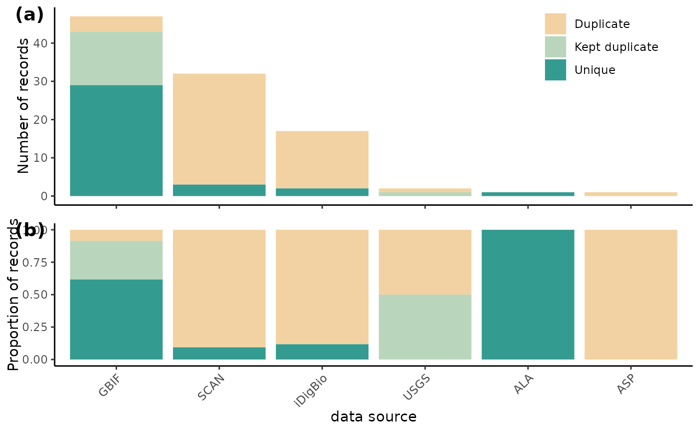
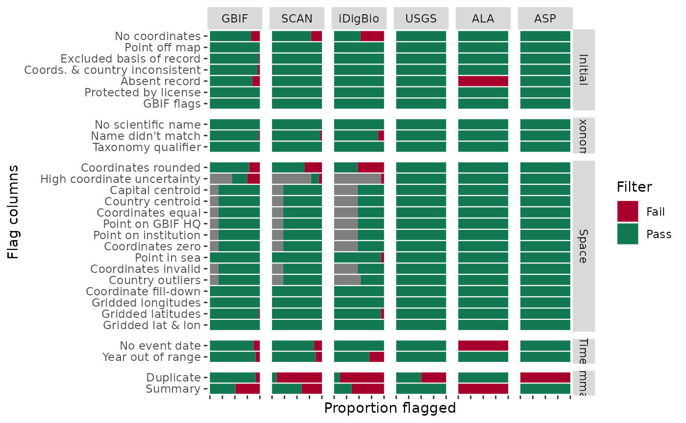
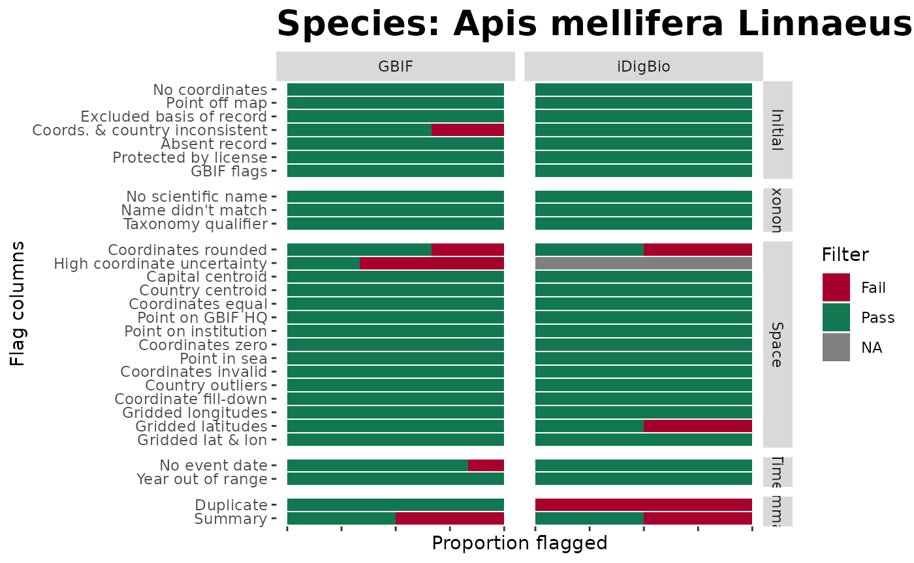
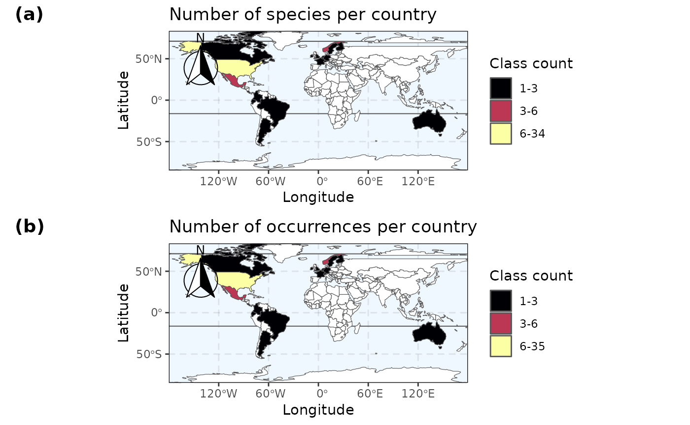

# Basic workflow

## [](https://github.com/jbdorey/BeeBDC)

This workflow is meant to be a basic example workflow of how a user
might take a flagged version of our (or some other) occurrence dataset
and filter for specific taxa or countries, re-apply flagging functions,
re-filter the data, or make maps based of those data.

## 0.0 Script preparation

### 0.1 Working directory

Choose the path to the root folder in which all other folders can be
found.

``` r
RootPath <- paste0("/your/path/here")
```

``` r
# Create the working directory in the RootPath if it doesn't exist already
if (!dir.exists(paste0(RootPath, "/Data_acquisition_workflow"))) {
    dir.create(paste0(RootPath, "/Data_acquisition_workflow"), recursive = TRUE)
}
# Set the working directory
setwd(paste0(RootPath, "/Data_acquisition_workflow"))
```

For the first time that you run BeeBDC, and if you want to use the renv
package to manage your packages, you can install renv…

            install.packages("renv", repos = "http://cran.us.r-project.org")

and then initialise renv the project.

            renv::init(project = paste0(RootPath,"/Data_acquisition_workflow")) 

If you have already initialised a project, you can instead just activate
it.

``` r
renv::activate(project = paste0(RootPath, "/Data_acquisition_workflow"))
```

### 0.2 Install packages (if needed)

You may need to install gdal on your computer. This can be done on a Mac
by using Homebrew in the terminal and the command “brew install gdal”.

To start out, you will need to install **BiocManager**, **devtools**,
**ComplexHeatmap**, and **rnaturalearthhires** to then install and fully
use **BeeBDC**.

``` r
if (!require("BiocManager", quietly = TRUE)) install.packages("BiocManager", repos = "http://cran.us.r-project.org")

BiocManager::install("ComplexHeatmap")
```

``` r
# Install remotes if needed
if (!require("remotes", quietly = TRUE)) install.packages("remotes", repos = "http://cran.us.r-project.org")
# Download and then load rnaturalearthhires
remotes::install_github("ropensci/rnaturalearthhires")
install.packages("rnaturalearthhires", repos = "https://ropensci.r-universe.dev",
    type = "source")
library(rnaturalearthhires)
```

Now install **BeeBDC**.

``` r
install.packages("BeeBDC")
library(BeeBDC)
```

Snapshot the renv environment.

``` r
renv::snapshot(project = paste0(RootPath, "/Data_acquisition_workflow"), prompt = FALSE)
## The following package(s) will be updated in the lockfile:
## 
## # RSPM -----------------------------------------------------------------------
## - renv   [* -> 1.1.5]
## 
## The version of R recorded in the lockfile will be updated:
## - R      [* -> 4.5.2]
## 
## - Lockfile written to "/tmp/RtmpsbdJ0a/Data_acquisition_workflow/renv.lock".
```

Set up the directories used by **BeeBDC**. These directories include
where the data, figures, reports, etc. will be saved. The RDoc needs to
be a path RELATIVE to the RootPath; i.e., the file path from which the
two diverge.

``` r
BeeBDC::dirMaker(RootPath = RootPath, RDoc = "vignettes/BeeBDC_main.Rmd") %>%
    # Add paths created by this function to the environment()
list2env(envir = parent.env(environment()))
```

### 0.3 Load packages

Load packages.

``` r
lapply(c("ComplexHeatmap", "magrittr"), library, character.only = TRUE)
## Loading required package: grid
## 
## Attaching package: 'grid'
## The following object is masked from 'package:terra':
## 
##     depth
## ========================================
## ComplexHeatmap version 2.26.0
## Bioconductor page: http://bioconductor.org/packages/ComplexHeatmap/
## Github page: https://github.com/jokergoo/ComplexHeatmap
## Documentation: http://jokergoo.github.io/ComplexHeatmap-reference
## 
## If you use it in published research, please cite either one:
## - Gu, Z. Complex Heatmap Visualization. iMeta 2022.
## - Gu, Z. Complex heatmaps reveal patterns and correlations in multidimensional 
##     genomic data. Bioinformatics 2016.
## 
## 
## The new InteractiveComplexHeatmap package can directly export static 
## complex heatmaps into an interactive Shiny app with zero effort. Have a try!
## 
## This message can be suppressed by:
##   suppressPackageStartupMessages(library(ComplexHeatmap))
## ========================================
## 
## Attaching package: 'ComplexHeatmap'
## The following object is masked from 'package:terra':
## 
##     draw
## The following object is masked from 'package:R.utils':
## 
##     draw
```

## 2.0 Taxon example

If you want to filter the dataset to a particular taxon of interest, you
can do so quite easily using **dplyr** from the **tidyverse** group of
packages. To filter to a selected bee genus, in our case Anthophorini…

``` r
# Load some package data — the taxonomy and a flagged example dataset Download
# the full beesTaxonomy file
taxonomyFile <- BeeBDC::beesTaxonomy()
```

``` r
# load in the small test dataset in the background
system.file("extdata", "testTaxonomy.rda", package = "BeeBDC") |>
    load()
# Rename the file
taxonomyFile <- testTaxonomy
rm(testTaxonomy)
```

``` r
# Load the example beesFlagged dataset
beesFlagged <- BeeBDC::beesFlagged

selectedGenera <- taxonomyFile %>%
    # Select only tribe anthophorini (for example)
dplyr::filter(tolower(tribe) == tolower("anthophorini")) %>%
    distinct(genus)

# Filter the data
taxonData <- beesFlagged %>%
    dplyr::filter(genus %in% selectedGenera$genus)
# View the data
taxonData
```

    ## # A tibble: 2 × 124
    ##   database_id  scientificName family subfamily genus subgenus subspecies species
    ##   <chr>        <chr>          <chr>  <chr>     <chr> <chr>    <lgl>      <chr>  
    ## 1 Dorey_data_… Habropoda mis… Apidae Apinae    Habr… NA       NA         Habrop…
    ## 2 Dorey_data_… Deltoptila el… Apidae Apinae    Delt… NA       NA         Deltop…
    ## # ℹ 116 more variables: specificEpithet <chr>, infraspecificEpithet <chr>,
    ## #   acceptedNameUsage <lgl>, taxonRank <chr>, scientificNameAuthorship <chr>,
    ## #   identificationQualifier <lgl>, higherClassification <chr>,
    ## #   identificationReferences <lgl>, typeStatus <chr>,
    ## #   previousIdentifications <chr>, verbatimIdentification <chr>,
    ## #   identifiedBy <chr>, dateIdentified <chr>, decimalLatitude <dbl>,
    ## #   decimalLongitude <dbl>, stateProvince <chr>, continent <chr>, …

## 3.0 Country example

Similarly to the above you can filter for only countries of interest.
Keep in mind, that sometimes the *country* column may not hold all of
the records that fall in that country, if it, or the coordinates, have
been entered incorrectly.

``` r
# Select your study area
studyArea <- c("Canada", "United states", "Mexico", "Guatemala")
# Filter the data to that area
countryData <- beesFlagged %>%
    dplyr::filter(country %in% studyArea)
# View the data
countryData
```

    ## # A tibble: 49 × 124
    ##    database_id scientificName family subfamily genus subgenus subspecies species
    ##    <chr>       <chr>          <chr>  <chr>     <chr> <chr>    <lgl>      <chr>  
    ##  1 Dorey_data… Macrotera arc… Andre… Panurgin… Macr… NA       NA         Macrot…
    ##  2 Dorey_data… Exomalopsis s… Apidae Apinae    Exom… NA       NA         Exomal…
    ##  3 Paige_data… Augochlorella… Halic… Halictin… Augo… NA       NA         Augoch…
    ##  4 Dorey_data… Svastra duplo… Apidae Apinae    Svas… NA       NA         Svastr…
    ##  5 Dorey_data… Agapostemon f… Halic… Halictin… Agap… NA       NA         Agapos…
    ##  6 Dorey_data… Melissodes tr… Apidae Apinae    Meli… NA       NA         Meliss…
    ##  7 Dorey_data… Osmia pumila … Megac… Megachil… Osmia NA       NA         Osmia …
    ##  8 Dorey_data… Perdita bisho… Andre… Panurgin… Perd… NA       NA         Perdit…
    ##  9 Dorey_data… Melissodes lu… Apidae Apinae    Meli… NA       NA         Meliss…
    ## 10 Paige_data… Melecta thora… Apidae Apinae    Mele… NA       NA         Melect…
    ## # ℹ 39 more rows
    ## # ℹ 116 more variables: specificEpithet <chr>, infraspecificEpithet <chr>,
    ## #   acceptedNameUsage <lgl>, taxonRank <chr>, scientificNameAuthorship <chr>,
    ## #   identificationQualifier <lgl>, higherClassification <chr>,
    ## #   identificationReferences <lgl>, typeStatus <chr>,
    ## #   previousIdentifications <chr>, verbatimIdentification <chr>,
    ## #   identifiedBy <chr>, dateIdentified <chr>, decimalLatitude <dbl>, …

## 4.0 Filtering example

### 4.1 Simple filter

The **BeeBDC** package provides a simple function that can re-build the
*.summary* column based off of the filtering columns that are present in
the dataset (those starting with “.”). you can also choose which filters
you DO NOT want to implement using the dontFilterThese argument. In this
example, we are also removing all of the filtering columns in the output
dataset (removeFilterColumns = TRUE) and filtering to only completely
clean occurrences (filterClean = TRUE). For the latter, we are only
keeping *.summary* == TRUE.

``` r
filteredData <- 
  BeeBDC::summaryFun(data = beesFlagged,
   # Choose the columns to NOT filter (or NULL to filter all columns)
   dontFilterThese = c(".gridSummary", ".lonFlag", ".latFlag", ".uncer_terms",
                      ".uncertaintyThreshold"),
    # In the output, do you want to REMOVE all filtering columns (TRUE), or keep them (FALSE)
   removeFilterColumns = TRUE,
   # In the output, do you want to only keep clean data according to your filtering (TRUE),
    # Or keep all data and simply update the .summary column (FALSE)
  filterClean = TRUE) 
```

    ##  - We will NOT flag the following columns. However, they will remain in the data file.
    ## .gridSummary, .lonFlag, .latFlag, .uncer_terms, .uncertaintyThreshold

    ##  - summaryFun:
    ## Flagged 74 
    ##   The .summary column was added to the database.

    ##  - REMOVED all occurrences that were FALSE for the 'summary' column.

### 4.2 Uncertainty threshold

You may also want to change the *.uncertaintyThreshold* as we have
chosen a somewhat strict default of 1 km in our dataset. Here, we will
instead flag to 10 km (threshold = 10000 \[m\]). Additionally, we use
the **magrittr** package pipe (%\>%) to feed the outputs directly into
[`summaryFun()`](https://jbdorey.github.io/BeeBDC/reference/summaryFun.md)
to filter our data in one action!

``` r
filteredData <- beesFlagged %>%
  # Remove any exiting .uncertaintyThreshold column
  dplyr::select(!tidyselect::any_of(".uncertaintyThreshold")) %>%
    # Chose the coordinate uncertainty to filter to...
  BeeBDC::coordUncerFlagR(data = .,
                  uncerColumn = "coordinateUncertaintyInMeters",
                    # 10 km here
                  threshold = 10000) %>%
    # Now re-do the .summary column and filter the data using this new value
  BeeBDC::summaryFun(
  data = .,
  dontFilterThese = c(".gridSummary", ".lonFlag", ".latFlag", ".uncer_terms"),
  removeFilterColumns = TRUE,
  filterClean = TRUE)
```

    ## \coordUncerFlagR:
    ##  Flagged 3 geographically uncertain records:
    ##  The column '.uncertaintyThreshold' was added to the database.

    ##  - We will NOT flag the following columns. However, they will remain in the data file.
    ## .gridSummary, .lonFlag, .latFlag, .uncer_terms

    ##  - summaryFun:
    ## Flagged 75 
    ##   The .summary column was added to the database.

    ##  - REMOVED all occurrences that were FALSE for the 'summary' column.

### 4.2 Date filter

#### a. bdc_year_outOfRange

Another column that users are likely to want to pay close attention to
is the *.year_outOfRange* column that is set at 1950 in our dataset. In
this case, **bdc** provides the function where users can change the
year_threshold argument to, in this case, 1970. As with above, we then
use
[`summaryFun()`](https://jbdorey.github.io/BeeBDC/reference/summaryFun.md)
to get results in one go.

``` r
filteredData <- beesFlagged %>%
    # Remove any exisitng .year_outOfRange column
dplyr::select(!".year_outOfRange") %>%
    # Chose the minimum year to filter to...
bdc::bdc_year_outOfRange(data = ., eventDate = "year", year_threshold = 1970) %>%
    # Now re-do the .summary column and filter the data using this new value
BeeBDC::summaryFun(data = ., dontFilterThese = c(".gridSummary", ".lonFlag", ".latFlag",
    ".uncer_terms", ".uncertaintyThreshold"), removeFilterColumns = TRUE, filterClean = TRUE)
```

    ## 
    ## bdc_year_outOfRange:
    ## Flagged 23 records.
    ## One column was added to the database.

    ##  - We will NOT flag the following columns. However, they will remain in the data file.
    ## .gridSummary, .lonFlag, .latFlag, .uncer_terms, .uncertaintyThreshold

    ##  - summaryFun:
    ## Flagged 76 
    ##   The .summary column was added to the database.

    ##  - REMOVED all occurrences that were FALSE for the 'summary' column.

#### b. year range

Or, if you’re interested in a particular time period, again **dplyr**
comes to the rescue with some very straight forward filtering within a
year range.

``` r
filteredData <- 
  # The input dataset
  beesFlagged %>%
  # Chose the year range...
  dplyr::filter(year > 1950 & year < 1970) %>%
  # Now re-do the .summary column and filter the data using this new value
  BeeBDC::summaryFun(
    # Select the input dataset to filter
    data = .,
    # Choose the columns to NOT filter (or NULL to filter all columns)
    dontFilterThese = c(".gridSummary", ".lonFlag", ".latFlag", ".uncer_terms",
                        ".uncertaintyThreshold"),
    # In the output, do you want to REMOVE all filtering columns (TRUE), or keep them (FALSE)
    removeFilterColumns = TRUE,
    # In the output, do you want to only keep clean data according to your filtering (TRUE),
    # Or keep all data and simply update the .summary column (FALSE)
    filterClean = TRUE)
```

    ##  - We will NOT flag the following columns. However, they will remain in the data file.
    ## .gridSummary, .lonFlag, .latFlag, .uncer_terms, .uncertaintyThreshold

    ##  - summaryFun:
    ## Flagged 8 
    ##   The .summary column was added to the database.

    ##  - REMOVED all occurrences that were FALSE for the 'summary' column.

Users may choose any number of filtering steps form the main workflow to
include above
[`summaryFun()`](https://jbdorey.github.io/BeeBDC/reference/summaryFun.md),
just use pipes ‘%\>%’ between the function and use ‘.’ as the data input
because this will feed in the data aoutput from the above function into
the proceeding one.

## 5. Summary figures

Now, if you wanted to rebuild some figures, say after you’ve added or
filtered data, then you can use some of the below processes.

### 5.1 Duplicate chordDiagrams

Our
[`chordDiagramR()`](https://jbdorey.github.io/BeeBDC/reference/chordDiagramR.md)
function is very useful and it relies on two great packages,
**circlize** and **ComplexHeatmap**. Unfortunately, the latter is not
available on CRAN and so must be downloaded using **BiocManager**.

``` r
if (!require("BiocManager", quietly = TRUE)) {
    install.packages("BiocManager")
}
BiocManager::install("ComplexHeatmap", force = TRUE)
renv::snapshot()
```

We don’t actually have an example duplicates dataset with the package,
so I’ll magic one up behind the scences!

``` r
duplicates <- fileFinder(path = "PATH TO A FOLDER CONTAINING THE duplicateRun_ — could be supp. materials folder",
    fileName = "duplicateRun_") %>%
    readr::read_csv() %>%
    # Select only the stingless bee data
dplyr::filter(database_id %in% stinglessData$database_id | database_id_match %in%
    stinglessData$database_id)
```

Then, set some parameters for figure borders and run your data through
[`chordDiagramR()`](https://jbdorey.github.io/BeeBDC/reference/chordDiagramR.md).

``` r
# Choose the global figure parameters
  par(mar = c(2, 2, 2, 2)/2, mfrow = c(1,1))

# Create the chorDiagram. You can leave many of the below values out but we show here
# the defaults

BeeBDC::chordDiagramR(
  # The duplicate data from the dupeSummary function output  
  dupeData = duplicates,
  outPath = OutPath_Figures,
  fileName = "ChordDiagram.pdf",
  # These can be modified to help fit the final pdf that's exported.
  width = 9,
  height = 7.5,
  bg = "white",
  # How few distinct dataSources should a group have to be listed as "other"
  smallGrpThreshold = 3,
  title = "Duplicated record sources",
  # The default list of colour palettes to choose from usign the paleteer package
  palettes = c("cartography::blue.pal", "cartography::green.pal", 
               "cartography::sand.pal", "cartography::orange.pal", "cartography::red.pal",
               "cartography::purple.pal", "cartography::brown.pal"),
  canvas.ylim = c(-1.0,1.0), 
  canvas.xlim = c(-0.6, 0.25),
  text.col = "black",
  legendX = grid::unit(6, "mm"),
  legendY = grid::unit(18, "mm"),
  legendJustify = c("left", "bottom"),
  niceFacing = TRUE)
```

### 5.2 Duplicate histogram

In this example, we will use one of the example datasets to show you how
this works. We will use beesFlagged, which has been filtered from a
larger dataset and contains duplicates from that larger dataset. To
print the plot in R, you need to specify returnPlot = TRUE, otherwise it
will only save to the disk

``` r
data("beesFlagged", package = "BeeBDC")

# Create a figure shoring the total number of duplicates, kept duplicates, and unique
# records for each datasource (simplified to the text before the first underscore) and
# the proportion of the above for each data source
BeeBDC::dupePlotR(
  data = beesFlagged,
  # The outPath to save the plot as
  outPath = tempdir(),
  fileName = "Fig3_duplicatePlot.pdf",
  # Colours in order: duplicate, kept duplicate, unique
  dupeColours = c("#F2D2A2","#B9D6BC", "#349B90"),
  # Plot size and height
  base_height = 7, base_width = 7,
  legend.position = c(0.85, 0.8),
  # Extra variables can be fed into forcats::fct_recode() to change names on plot
  GBIF = "GBIF", SCAN = "SCAN", iDigBio = "iDigBio", USGS = "USGS", ALA = "ALA", 
  ASP = "ASP",
  returnPlot = TRUE
)
```



### 5.3 Flags by source

The
[`plotFlagSummary()`](https://jbdorey.github.io/BeeBDC/reference/plotFlagSummary.md)
function is one of the most important for quickly summarising and
checking that your data and flags have worked together correctly. It can
be a good starting point for error-checking. You will also see in
[`plotFlagSummary()`](https://jbdorey.github.io/BeeBDC/reference/plotFlagSummary.md)
that you can filter to particular species and also output quick point
maps of those species.

#### a. all taxa in dataset

``` r
# Visualise all flags for each dataSource (simplified to the text before the first underscore)
BeeBDC::plotFlagSummary(
  data = beesFlagged,
  # Colours in order of pass (TRUE), fail (FALSE), and NA
  flagColours = c("#127852", "#A7002D", "#BDBABB"),
  fileName = paste0("Fig4_FlagsPlot_", Sys.Date(),".pdf"),
  outPath = tempdir(),
  width = 15, height = 9,
  # Extra variables can be fed into forcats::fct_recode() to change names on plot
  GBIF = "GBIF", SCAN = "SCAN", iDigBio = "iDigBio", USGS = "USGS", ALA = "ALA", 
  ASP = "ASP",
  returnPlot = TRUE
)
```

    ##  - Preparing data to plot...
    ##  - Building plot...



\###### b. Single sp. summary \####

In fact, lets build one of these single-species example below using the
same data and the omnipresent *Apis mellifera*.

``` r
# Visualise all flags for each dataSource (simplified to the text before the first underscore)
  # A clever user might also realise the potential to summarise and produce outputs in other columns
BeeBDC::plotFlagSummary(
  # WARNING: alternate path if wanting to produce figures for the selected taxonData (2.0 above)
  # Select only the taxonData data
  data = beesFlagged,
  # Colours in order of pass (TRUE), fail (FALSE), and NA
  flagColours = c("#127852", "#A7002D", "#BDBABB"),
  fileName = paste0("FlagsPlot_Amell", Sys.Date(),".pdf"),
  outPath = tempdir(),
  width = 15, height = 9,
  # OPTIONAL:
         #  # Filter to species
           speciesName = "Apis mellifera Linnaeus, 1758",
             # column to look in
           nameColumn = "scientificName",
           # Save the filtered data
           saveFiltered = FALSE,
     # Filter column to display on map
           filterColumn = ".summary",
           plotMap = TRUE,
       # amount to jitter points if desired, e.g. 0.25 or NULL
     jitterValue = NULL,
       # Map opacity value for points between 0 and 1
     mapAlpha = 1,
  returnPlot = TRUE,
  # Extra variables can be fed into forcats::fct_recode() to change names on plot
  GBIF = "GBIF", SCAN = "SCAN", iDigBio = "iDigBio", USGS = "USGS", ALA = "ALA", 
  ASP = "ASP", CAES = "CAES", 'B. Mont.' = "BMont", 'B. Minkley' = "BMin", Ecd = "Ecd",
  Gaiarsa = "Gai", EPEL = "EPEL"
)
```

    ##  - Filtering to selected species...
    ##  - Selected species has 8 occurrences.
    ##  - Preparing data to plot...
    ##  - Building plot...



### 5.4 Maps

We can also make some overall summary maps at the country level using
[`summaryMaps()`](https://jbdorey.github.io/BeeBDC/reference/summaryMaps.md).
If you get an error about breaks not being unique, then reduce class_n.

``` r
BeeBDC::summaryMaps(data = beesFlagged, width = 10, height = 10, class_n = 3, class_Style = "jenks",
    outPath = tempdir(), fileName = "CountryMaps_jenks.pdf", returnPlot = TRUE)
```

    ## Spherical geometry (s2) switched off

    ##  - Extracting country data from points...

    ## although coordinates are longitude/latitude, st_intersects assumes that they
    ## are planar

    ## although coordinates are longitude/latitude, st_intersects assumes that they
    ## are planar

    ## Extraction complete.
    ##  - Buffering naturalearth map by pointBuffer...

    ## dist is assumed to be in decimal degrees (arc_degrees).
    ## although coordinates are longitude/latitude, st_intersects assumes that they
    ## are planar
    ## although coordinates are longitude/latitude, st_intersects assumes that they
    ## are planar



## 6.0 Save data

``` r
mapData %>%
    readr::write_excel_csv(paste0(DataPath, "/Output/Intermediate/", "cleanTaxon_",
        Sys.Date(), ".csv"))
```
